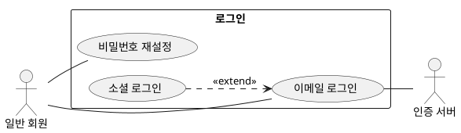

# 0.requirement — {{유닛 한 줄 제목}}

> 유닛: {{domain}}/{{NN.unit}} · 브랜치: {{branch}}
> `/flow:prd` 산출. **무엇이 필요한가**만 적는다 — 구조·기술 선택은 `/flow:design`(`1.design.md`).

**상위**: {{USER-1}} ← {{SYS-1}}   *(없으면 "없음(고아)" — `/flow:verify project`가 표시)*

## 배경 / 문제

{{어떤 상황·문제에서 이 작업이 나왔나}}

## 액터  **[문서 필수]**

| 액터 | 유형 | 목적 |
|:--|:--|:--|
| {{일반 회원}} | 주 액터 | {{로그인해 서비스를 쓴다}} |
| {{인증 서버}} | 보조 시스템 | {{토큰을 발급한다}} |

## 요구 목록 (유스케이스)  **[진행 필수]**

**기능 레벨은 요구를 유스케이스로 쓴다** — 액터·흐름·예외가 곧 요구다. 시스템·도메인 레벨은 흐름이 없으므로 `요구` 한 칸으로 적는다.

작성 규약은 **`usecase` 스킬**이 정본이다 — 입도·필드·작성 순서·관계 표기.

| ID | 종류 | 유스케이스 | 액터 | 주 흐름 | 예외 | 완료 기준 (측정 가능) | 측정 방법 | 상태 |
|:--|:--|:--|:--|:--|:--|:--|:--|:--|
| {{USER-LOGIN-1}} | | {{이메일 로그인}} | {{일반 회원}} | {{입력 → 검증 → JWT 발급}} | {{비번 불일치 → U001 · 3회 초과 → 잠금}} | {{성공 시 JWT 발급(30분)}} | — | |
| {{USER-LOGIN-2}} | | {{비밀번호 재설정}} | {{일반 회원}} | {{요청 → 링크 발송 → 검증 → 변경}} | {{링크 만료 → U003}} | {{링크 10분 만료 · 재설정 후 기존 세션 폐기}} | — | |
| {{USER-LOGIN-3}} | | {{소셜 로그인}} | {{일반 회원}} | {{제공자 선택 → 동의 → 계정 연결}} | {{연결 실패 → U004}} | {{기존 계정과 이메일이 같으면 연결}} | — | |
| {{USER-LOGIN-4}} | {{성능}} | {{로그인 응답 3초 내}} | — | — | — | {{p95 3초}} | **{{k6로 50 VU 3분 · 로그인 API p95 추출}}** | |
| {{USER-LOGIN-9}} | | {{현행: 세션 인증}} | {{일반 회원}} | {{역추출 — `AuthFilter.java`}} | | | 역추출 — `AuthFilter.java` | {{확인 필요}} |

**하나의 유스케이스 = 사용자가 한 자리에서 끝내는 하나의 목표** (Cockburn sea-level).

| ✕ 이렇게 쪼개지 않는다 | ✓ |
|:--|:--|
| 게시글 등록 / 수정 / 삭제 / 조회 | **게시글 작성·게시** — CRUD는 흐름 스텝 |
| 로그인 / **로그인 실패 처리** | **로그인** — 실패는 예외 흐름 |

- **엔드포인트 하나 = 유스케이스 하나가 아니다.**
- **`종류`는 비우면 `기능 제약`이다.** 이 유스케이스만의 비기능이면 적는다(`성능`·`보안`·`원가`·`법·정책`) — **횡단이면 `SYS-*`다.** 판정은 `traceability`: *"도메인을 하나 더 추가하면 거기에도 걸리나?"*
- **`측정 방법`은 `종류`가 있는 요구만 채운다.** 기능 제약은 `—`로 두면 된다 — `5.verify`의 `완료 기준 매핑`이 그 역할을 한다. **`종류`가 있는데 비면 영구 gap이다**(`verify project`가 "측정 방법 미정"으로 낸다). 무엇을 적나는 `13.architecture`의 종류별 표와 같다 — 성능은 **도구·부하 조건·뽑을 값**, 원가는 **무엇을 합산하나·데이터 출처**, `법·정책`은 **"사람 판단 — 자동화 불가"**.
- **`상태`는 비우면 `확정`이다** — 정본은 `traceability`. `legacy` 역추출만 `확인 필요`로 적고, 그 요구엔 신규 게이트(완료 기준 측정 가능·측정 방법)가 걸리지 않는다.
- ID는 **불변·append-only**. 삭제는 `~~ID~~ (deprecated)`, 분할은 하위 ID(`-3` → `-3.1`·`-3.2`).
- **유스케이스에 별도 번호를 붙이지 않는다** — 요구 ID가 곧 유스케이스 ID다.
- 측정 불가능한 완료 기준은 그대로 두지 않는다 — 되묻거나 `확인 필요`로 표기.

## 유스케이스 그림

**정본이 나뉜다** — 각자 자기 것만 갖는다(`usecase`).

| 무엇 | 정본 |
|:--|:--|
| UC 목록 · 액터 · 종류 · 완료 기준 · 상태 | **위 표** |
| **관계** (`«include»`·`«extend»`) | **이 그림** |

- **표에 없는 유스케이스·액터를 그림에 넣지 않는다.** 반대도 안 된다 — `doc-verify`가 이름 집합으로 대조한다.
- 관계 표기 규칙은 `usecase`. **일반화(상속)는 쓰지 않는다.**
- **관계를 남발하지 않는다.** 대부분은 액터-UC 연관뿐이다.

## 유스케이스 상세 *(조건부 필수)*

**둘 중 하나라도 해당하는 유스케이스는 반드시 쓴다.** 둘 다 아니면 표 한 줄로 끝낸다.

| 조건 | 왜 |
|:--|:--|
| **업무 규칙이 있다** | 규칙이 없으면 `test-spec`이 **경계값 테스트를 도출할 근거가 없다** |
| **예외 흐름이 둘 이상이다** | 표 한 칸에 안 들어간다 |

**{{USER-LOGIN-1}} 이메일 로그인**

- **시작 신호**: *(액터가 사람이 아닐 때만 — 배치·스케줄·이벤트. 사용자 행동이면 생략)*
- **사전조건**: {{계정이 존재하고 잠금 상태가 아니다}}
- **주 흐름**: {{1) 회원이 이메일·비번을 입력한다 2) 시스템이 대조한다 3) JWT를 발급한다}}
- **대안 흐름**: {{A1. 이미 로그인 상태 → 기존 토큰 갱신}}
- **예외 흐름**: {{E1. 비번 불일치 → U001 · E2. 3회 초과 → 잠금}}
- **사후조건**: {{세션이 생기고 마지막 로그인 시각이 갱신된다}}
- **업무 규칙**  **[진행 필수]** — 단 **규칙이 있을 때만**
  - {{R1. 3회 실패 시 잠금 — 관리자 계정은 예외}}
  - {{R2. 잠금 해제는 30분 경과 또는 관리자 조치}}
  - 참조: {{DR-1}}(도메인 규칙) · {{SYS-3}}(횡단 제약) ← **번호만 가리킨다. 내용을 복사하지 않는다**

**업무 규칙은 완료 기준과 다르다.**

| | 무엇 |
|:--|:--|
| 완료 기준 | **이 유스케이스가 끝났나** — 완료 판정 |
| **업무 규칙** | **어떤 조건에서 어떻게 되나** — 판정 기준·한도·예외 대상 |

- **규칙마다 `R번호`를 단다** — 테스트가 어느 규칙을 검증하는지 가리킬 수 있어야 한다.
- **숫자·기간·예외 대상을 명시한다.** "여러 번 실패하면"은 규칙이 아니다.
- `test-spec`이 이걸 읽어 경계값을 만든다 — `2회 통과` / `3회 잠김` / `관리자 3회 안 잠김`.
- **다른 유스케이스에도 걸리는 규칙은 여기 적지 않는다** — `09.domain`의 `DR번호`로 올리고 `참조:`로 가리킨다(`usecase`). 복사하면 고칠 곳이 둘이 된다.

## 의존

이 요구가 **먼저 끝나야 하는 것**에 걸려 있으면 적는다. 없으면 "없음".

| 무엇 | 종류 | 상태 |
|:--|:--|:--|
| {{인증 서버 토큰 API}} | 외부 시스템 | {{확인 필요}} |
| {{USER-1 회원 가입}} | 선행 요구 | {{완료}} |

## 범위 밖 (non-goal)

- {{이번에 하지 않을 것 — 예: SMS 인증 · 생체 인증}}

> **요구 목록에 있는 것을 여기 적지 않는다.** 같은 항목이 요구이면서 범위 밖이면 무엇을 만드는지 알 수 없다 — `doc-verify`가 이름으로 대조한다.

## 확인 필요

- {{추측으로 채우지 않은 항목. `legacy` 역추출이면 전부 여기 해당}}
