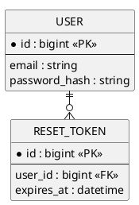
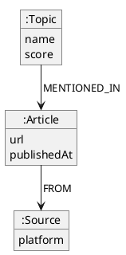
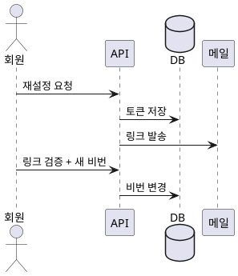

# 1.design — {{유닛 한 줄 제목}}

> 유닛: {{domain}}/{{NN.unit}} · 입력: `0.requirement.md`
> `/flow:design` 산출. **구조를 확정**한다 — task 분할·계약은 `/flow:design` 의 기능 레벨(`2.task`·`3.contract`).

## 분석

설계의 근거. 추측과 확인을 구분해 적는다.

- **영향**: {{기존 DB·API·외부 연동 중 이 변경이 건드리는 것}}
- **제약**: {{기술·정책·성능 제약 (출처: `00.ref/00.architecture`)}}
- **사각지대**: {{repo 이력에서 나온 것 — revert·중단된 마이그레이션·우회 미들웨어}}
- **근본원인** *(버그일 때)*: {{재현 조건 → 원인. 추정이면 그렇게 표기}}

## 데이터 구조

{{엔티티·필드·관계. 기존 스키마와의 차이를 명시}} · 저장소: {{Postgres · Neo4j · MongoDB}}

**그림은 저장소에 맞춰** 그린다. 관계형이면 ERD, 그래프면 노드·관계도.



*그래프 저장소일 때 예시 — 위 대신 이렇게:*



**인덱스 · 제약**

| 대상 | 종류 | 이유 |
|:--|:--|:--|
| {{reset_token.user_id}} | 인덱스 | {{만료 조회가 잦다}} |
| {{user.email}} | 유니크 | {{중복 가입 방지}} |

> DDL 정본은 `00.ref/02.db-schema/`다 — 관계형 `{table}.sql` · 그래프 `graph.cypher`. **여기엔 구조와 이유만** 적고 실행문을 중복 작성하지 않는다.

## 기능 구조

{{처리 흐름·책임·경계. 예: 요청 → 토큰 발급 → 메일 발송 → 검증 → 변경}}



## 화면 구조 *(프론트만)*

디자인 토큰·컴포넌트는 테마 정본(`00.ref/04.theme/`)을 참조한다 — **여기서 색·폰트를 새로 정하지 않는다.**

**테마를 안 썼으면 토큰을 적지 않는다.** 배치·요소·상태·이동은 토큰과 무관하게 설계된다 — 테마는 나중에 입혀도 된다.

**`SCR-N`은 `13.architecture`의 `화면 지도`에서 발급받는다** — 제품 전체에서 유일하다(`traceability`). **여기서 `SCR-1`부터 새로 시작하지 않는다** — 같은 번호가 여러 유닛에 생기면 화면 이동을 가리킬 수 없다.

**{{SCR-7}} {{비밀번호 재설정 요청}}**

- **목적**: {{메일로 재설정 링크를 받는다}}
- **배치**
  ```
  {{ [로고]  제목  [이메일 입력]  [보내기]  ← 로그인으로 }}
  ```
- **요소**

  | 이름 | 타입 | 동작 | 검증 |
  |:--|:--|:--|:--|
  | {{이메일}} | 입력 | {{엔터 시 전송}} | {{형식·필수}} |
  | {{보내기}} | 버튼 | {{POST /reset}} | {{연타 방지}} |

- **상태**: 빈 {{초기}} · 로딩 {{버튼 스피너}} · 오류 {{U001 문구}} · 완료 {{안내 문구}}
- **이동**: {{로그인}} → 여기 → {{완료 안내}}

## 엣지 케이스

정상 흐름 밖에서 무슨 일이 나는가. **여기서 빠뜨리면 구현·테스트에서도 빠진다.**

- {{같은 메일로 연속 요청 → 이전 토큰 무효화}}
- {{만료 직전 클릭 → 서버 시각 기준 판정}}
- {{탈퇴한 계정 → 존재 여부를 노출하지 않고 같은 응답}}

## 배포 · 롤백 · 마이그레이션

무중단으로 넣고 **되돌릴 수 있나**. 해당 없으면 "없음".

| 항목 | 내용 |
|:--|:--|
| 배포 순서 | {{DB 마이그레이션 → BE → FE}} |
| 마이그레이션 | {{`reset_token` 테이블 신설 — 스크립트는 소스 트리에}} |
| **어디까지 돌리나** | **개발·로컬에서 실제로 실행해 검증** · **운영 적용은 배포 시스템·사람** (`CLAUDE.md`의 `가드레일`) |
| 롤백 | {{FE 되돌림 → BE 되돌림. 테이블은 남겨도 무해}} |
| 되돌릴 수 없는 것 | {{있으면 명시 — 데이터 삭제·비가역 변환}} |

- **개발에서 안 돌려보면 스크립트가 맞는지 모른다.** "스크립트만 작성"으로 끝내지 않는다.
- **`00.ref/02.db-schema/`를 같은 커밋에 갱신한다** — 거기가 지금 상태의 정본이다. 안 하면 다음 세션이 없는 컬럼을 믿는다.

## 설계 요소  **[진행 필수]**

| ID | 설계 요소 | 충족 요구 |
|:--|:--|:--|
| D-1 | {{User 테이블 + 토큰 발급 로직}} | {{USER-LOGIN-1}}, {{SYS-1}} |
| D-2 | {{실패 카운터 · 잠금 정책}} | {{USER-LOGIN-2}} |

- **직접 충족만** 태그한다. 부모 요구는 전이로 추적된다(`0.requirement.md` 상단 선언).
- 횡단 요구(`SYS-*`)는 부모 체인에 없으므로 **직접 적는다**.
- 요구가 설계 요소로 하나도 안 덮이면 누락이다 — 기능 레벨로 내려가기 전에 채운다.

## 결정 · 기각 대안  **[문서 필수]**

| 결정 | 택한 안 | 기각 대안 · 사유 |
|:--|:--|:--|
| {{메일 발송 방식}} | {{큐 비동기}} | {{동기 발송 — 응답 지연 200ms 초과}} |

> 중요한 아키텍처 결정·정책 변경은 `doc/02.decisions/` ADR로도 남긴다.
