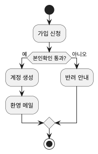

# {{NN}}.{{도메인}} — {{한 줄 설명}}

> `/flow:prd domain`·`/flow:design domain` 산출. **이 도메인이 무엇을 책임지는가.**
> 구현은 없다 — 여기서 정지하고 `00.ref/`의 정본이 된다.

**배포 단위**: {{shorts-svc}}   *(모놀리식이면 "단일" · 정본은 `00.architecture/01.design.md`의 구성 요소 표)*

> **도메인 요구엔 부모가 없다.** `SYS-*`는 **횡단 제약**이라 특정 도메인의 부모가 아니다 — 여러 도메인에 동시에 적용된다.
> 어느 `SYS-*`를 지켜야 하는지는 **설계 요소가 직접 태그**한다(`traceability`). 여기 상단에 적지 않는다.

## 요구

| ID | 종류 | 요구 | 완료 기준 | 측정 방법 | 상태 |
|:--|:--|:--|:--|:--|:--|
| {{USER-1}} | | {{회원은 가입·로그인·탈퇴한다}} | {{탈퇴 후 30일 내 복구 가능}} | — | |
| {{USER-2}} | {{법·정책}} | {{탈퇴 후 개인정보는 30일 내 파기}} | {{파기 로그 100%}} | **사람 판단 — 자동화 불가** | |
| {{USER-9}} | | {{현행: 휴면 계정은 1년 미접속}} | | 역추출 — `UserScheduler.java` | {{확인 필요}} |

- **`종류`는 비우면 `기능 제약`이다.** 이 도메인에만 걸리는 비기능이면 적는다(`성능`·`보안`·`원가`·`법·정책`).
- **`측정 방법`은 `종류`가 있는 요구만 채운다** — 세 레벨(`00.requirement`·여기·`13.architecture`)이 같은 규칙이다. 기능 제약은 `—`, **`종류`가 있는데 비면 영구 gap**이다. `법·정책`은 **"사람 판단 — 자동화 불가"**라고 적는다(비운 게 아니다).
- **`SYS-*`인지 도메인 요구인지는 이렇게 가른다** (`traceability`): **"도메인을 하나 더 추가하면 이 요구가 거기에도 걸리나?"** 걸리면 `SYS-*`다. **도메인이 하나뿐이어도 이 질문은 답할 수 있다.**
- **`상태`는 비우면 `확정`이다** — 정본은 `traceability`. `legacy` 역추출만 `확인 필요`로 적는다.

## 경계  **[문서 필수]** — 단 **도메인이 둘 이상일 때만**

- **책임진다**: {{계정·인증·프로필}}
- **책임지지 않는다**: {{결제 수단 — payment 도메인}}
- **맞닿은 도메인**: {{order — 주문자 식별만 제공}}
- **경계를 넘는 방법**: {{같은 배포 단위 안이면 직접 호출 · 다른 서비스면 Kafka 이벤트}} *(정본은 `00.architecture/01.design.md`의 의존 방향)*

> **도메인이 하나뿐이면 이 절을 비운다.** DDD의 Bounded Context는 **경계 밖에 다른 컨텍스트가 있을 때** 의미가 있다 — 하나면 경계가 곧 시스템 경계이고 그건 `13.architecture`에 있다. 도메인이 늘어날 때 채운다.

## 용어  **[문서 필수]**

한 도메인 전용 용어만. 공통은 `00.common.md`.

- **{{휴면}}**: {{1년 미접속. 로그인은 막고 데이터는 유지}}

## 업무 규칙  **[진행 필수]** — 단 **규칙이 있을 때만**

**이 도메인의 여러 유스케이스가 공유하는 판정 기준·한도·예외.** 유스케이스 하나에만 걸리는 규칙은 여기 적지 않는다 — 그 유스케이스 상세에 적는다(`usecase`).

| ID | 규칙 | 예외 대상 |
|:--|:--|:--|
| {{DR-1}} | {{반차는 0.5일로 센다}} | — |
| {{DR-2}} | {{3일 이상 연속은 팀장+부서장 2단 결재}} | {{임원은 1단}} |
| {{DR-3}} | {{마감(매월 25일) 이후 신청은 다음 달로 이월}} | {{경조사는 즉시}} |

**어느 레벨에 적나** — 규칙이 걸리는 범위로 정한다.

| 범위 | 어디 | ID |
|:--|:--|:--|
| 유스케이스 하나 | `0.requirement.md`의 유스케이스 상세 | `R번호` |
| **이 도메인의 여러 유스케이스** | **여기** | **`DR번호`** |
| 여러 도메인 | `00.ref/00.architecture/00.requirement.md`의 `SYS-*` | `SYS-번호` |

- **한 도메인 문서가 남의 규칙을 소유하지 않는다.** 결재 단수는 `approval` 도메인의 `DR-*`이고, `leave`의 유스케이스는 그걸 **참조**한다.
- **유스케이스는 `DR번호`를 참조만 한다** — 복사하면 고칠 곳이 둘이 된다.
- **`R번호`와 `DR번호`를 섞지 않는다.** `test-spec`이 어느 레벨의 규칙인지 보고 **검증 범위를 정한다**.
- 규칙마다 **숫자·기간·예외 대상을 명시**한다. "여러 번"·"오래되면"은 규칙이 아니다.

## 업무 흐름

여러 액터·시스템을 가로지르는 흐름. **유스케이스의 상위** — 유스케이스가 "시스템과의 한 상호작용"이면 여기는 "업무 전체".

- **시작 신호**: {{무엇이 이 흐름을 시작하나 — 사용자 요청 / 일정 / 외부 이벤트}}
- **참여자**: {{회원 · 관리자 · 인증 서버}}

| 항목 | 내용 |
|:--|:--|
| 갈림길 | {{본인확인 통과 여부 — 판단 주체: 인증 서버}} |
| 인계 | {{계정 생성 후 → 마케팅 도메인이 환영 메일}} |
| 예외 | {{인증 서버 무응답 → 대기열로 보류}} |
| 끝나는 상태 | {{가입 완료 · 반려 · 보류}} |

## 유닛 계획  **[진행 필수]** — 단 **역추출만 한 상태면 면제**

**`/flow:design domain`이 정한다.** 다음 층(`prd func` 이하)이 이 목록을 하나씩 돈다 — 비어 있으면 **무엇을 만들지가 없다.**

> **`domain legacy`로 현행 요구만 모은 상태면 비워둔다.** 그건 **무엇이 있나**를 적은 것이고 **무엇을 만들 것인가**가 아니다.
> 실제로 손댈 때 `/flow:design domain`이 이 절을 채운다. 그 전엔 `doc-verify`가 N/A로 본다.

| 유닛 | 무엇 | 덮는 요구 | 순서 근거 |
|:--|:--|:--|:--|
| {{00.collect}} | {{소재 수집·라이선스 확인}} | {{SHORTS-1}} | {{뒤 유닛의 입력}} |
| {{01.script}} | {{대본 생성}} | {{SHORTS-2,3}} | {{수집 결과 필요}} |

**쪼개는 기준** — 하나라도 안 맞으면 유닛이 아니다.

| 기준 | 뜻 |
|:--|:--|
| **혼자 검증된다** | 그 유닛만으로 `verify unit`이 돌아간다. 다른 유닛이 있어야 테스트되면 너무 작게 쪼갠 것 |
| **요구를 하나 이상 덮는다** | 어떤 요구도 안 덮으면 유닛이 아니다 — 기술 작업일 뿐이다 |
| **번호가 순서다** | 앞 유닛의 산출이 뒤 유닛의 입력. 순서가 없으면 번호를 아무렇게나 준 것 |

- **번호는 의존 순서로 준다.** `/flow:run`이 이 순서대로 돈다.
- **여럿이 유닛을 추가하면 번호가 부딪힌다** (`traceability`) — 발급 전 원격을 보고, 겹치면 **의존 순서를 다시 본다.** 번호만 밀면 순서가 틀어진다.
- **유닛이 6개를 넘으면 도메인을 잘못 나눴을 수 있다** — 도메인 분할을 다시 보자고 제안한다. 강제하지 않는다.
- **여기 없는 유닛을 `/flow:prd func`가 만들지 않는다.** 계획 밖 작업이 필요하면 이 절을 먼저 고친다.

## 하위 기능

`/flow:sync`가 자동 색인한다. 손으로 고치지 않는다. **계획(위)과 실제(아래)가 다르면 드리프트다.**

상태값은 `traceability`가 정본이다 — `설계` · `명세` · `구현중` · `검증됨` · `정지(사유)`.

| 유닛 | 상태 | 요구 |
|:--|:--|:--|
| {{00.login}} | {{검증됨}} | {{USER-LOGIN-1,2}} |
| {{01.reset}} | {{정지(critical)}} | {{USER-RESET-1}} |

## 확인 필요

- {{[NEEDS CLARIFICATION] 휴면 해제를 본인이 하나 관리자가 하나}}

## History

- {{YYYYMMDD}} {{변경 내용 / 사유}}
