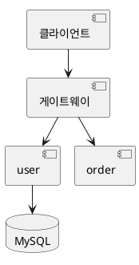
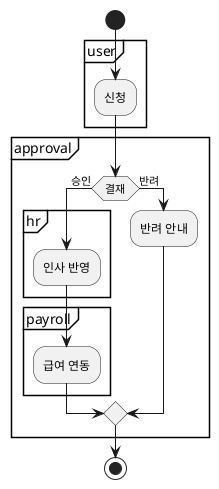
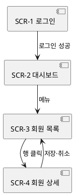

# 00.requirement / 01.design — 시스템 레벨

> `/flow:prd sys`(요구) · `/flow:design sys`(구조) 산출. 착지: `doc/00.ref/00.architecture/`
> **여러 도메인에 걸치는 것만** 여기 온다. 한 도메인에서 끝나면 `09.domain`, 기능 하나면 `01.work/`.
> 구현은 없다 — 여기서 정지하고 `00.ref/`의 정본이 된다.

---

## 00.requirement.md — 시스템 요구

### 목표  **[문서 필수]**

**우리가 통제할 수 없는 것**과 **통제할 수 있는 것**을 나눠 적는다. 요구는 통제할 수 있는 것만 된다.

| 목표 (통제 못 함) | 이걸 위해 우리가 하는 것 (요구가 됨) |
|:--|:--|
| {{월 100만원 수익}} | {{SYS-5 편당 원가 500원 이하 · SYS-8 하루 3편 자동 발행}} |
| {{조회수 10만}} | {{SYS-9 60초 안에 후킹 · 썸네일 A/B}} |

- **목표를 요구로 적지 않는다.** "조회수 10만"은 완료 기준으로 쓸 수 없다 — 우리가 만들지 않는 것이다.
- 목표는 **왜 이 요구가 있나**의 근거로만 남는다. 검증 대상이 아니다.

### 요구  **[진행 필수]** — 단 **횡단 제약이 있을 때만**

흐름이 없는 **횡단 제약**이다. 액터도 주 흐름도 없다. **종류를 함께 적는다** — 검증 방법이 다르다.

> **`SYS-*`가 0개여도 정상이다.** 작은 도구에 횡단 제약이 없으면 이 절이 빈다 — **억지로 만들지 않는다.** 판정은 `traceability`: *"도메인을 하나 더 추가하면 거기에도 걸리나?"*

| ID | 종류 | 요구 | 완료 기준 (측정 가능) | **측정 방법** | 상태 |
|:--|:--|:--|:--|:--|:--|
| {{SYS-1}} | 기능 제약 | {{모든 API는 JWT로 인증한다}} | {{미인증 요청은 401 · 만료 30분}} | 테스트 — `tests/scenarios/auth` | |
| {{SYS-2}} | **성능** | {{조회 응답 p95 200ms 이하}} | {{운영 부하 기준}} | **k6로 100 VU 5분 · p95 추출** | |
| {{SYS-5}} | **원가** | {{편당 원가 500원 이하}} | {{합산 500원}} | **LLM 토큰 로그 + S3 용량 + 전송량 → 스크립트로 합산** | |
| {{SYS-6}} | **법·정책** | {{저작권 침해 소재 사용 금지}} | {{출처 미확인 소재 0건}} | **사람 판단** — 자동화 불가 | |
| {{SYS-3}} | 보안 | {{LLM 출력은 사람 승인 전 업로드 금지}} | {{승인 없는 업로드 0건}} | 테스트 — 승인 없이 업로드 시도 | |
| {{SYS-9}} | 기능 제약 | {{현행: 모든 API는 세션 인증}} | | 역추출 — `AuthFilter.java` | {{확인 필요}} |

**`상태`는 비우면 `확정`이다** — 정본은 `traceability`. `legacy` 역추출만 `확인 필요`로 적고, 그 요구엔 `완료 기준`·`측정 방법`이 비어도 게이트가 걸리지 않는다.

**`측정 방법`을 비워두지 않는다.** 비면 그 요구는 영구 gap이 된다 — 검증할 방법이 없으니 영원히 확인이 안 된다.

| 종류 | 측정 방법에 무엇을 적나 |
|:--|:--|
| 기능 제약 · 보안 | **어느 테스트가** 확인하나 (경로) |
| **성능** | **도구 · 부하 조건 · 뽑을 값** — "부하 측정"만으로는 부족하다 |
| **원가** | **무엇을 합산하나 · 데이터를 어디서 가져오나** (실행 로그·청구서·계량 API) |
| **법·정책** | **"사람 판단 — 자동화 불가"** 라고 적는다. 이건 비운 게 아니다 |
| UX·체감 | 같음 |

- **측정 방법을 모르면 `확인 필요`에 적고 요구를 확정하지 않는다.** "원가 500원"만 있고 무엇을 합산할지 모르면 그건 아직 요구가 아니라 바람이다.

**`종류` 값** — `/flow:verify project`가 이 값으로 커버리지를 분류한다. **아래 표에 있는 것만 쓴다.**

| 종류 | 검증 | `verify project` 분류 |
|:--|:--|:--|
| 기능 제약 · 보안 | 테스트로 확인 | ✅ 검증됨 / ✗ gap |
| **성능** | 부하를 걸어 측정 | 측정했으면 ✅, 안 했으면 ✗ gap |
| **원가** | 실행 로그로 계산 | 계산했으면 ✅, 안 했으면 ✗ gap |
| **법·정책** | **자동 검증 불가** | ⚠ **항상 사람 확인 필요** |
| UX·체감 | 자동 검증 불가 | ⚠ 사람 확인 필요 |

- **`법·정책`을 gap으로 적지 않는다** — 테스트가 없는 게 정상이다. `사람 확인 필요`가 맞는 분류다.
- **`성능`·`원가`는 측정 안 하면 gap이다** — 자동 검증이 가능한데 안 한 것이다.
- **역추출 요구(`상태: 확인 필요`)는 `현행(미검증)`이고 gap이 아니다** — 코드엔 있고 우리 테스트만 없다. 사람이 `확정`으로 바꾸면 그때부터 gap 판정을 받는다.
- ID는 **불변 · append-only**. 기존 파일이 있으면 이어서 발급한다.
- 이 ID는 기능 요구의 부모 체인에 없다 → **설계 요소가 직접 태그**한다(`traceability`).

### 외부 의존  **[문서 필수]** — 단 **행이 있으면 `우리 요구와 맞나` 칸은 [진행 필수]**

시스템 전체가 남의 서비스에 매달려 있으면 여기 적는다. **죽으면 우리도 죽는다.**

> **쿼터가 요구를 이미 못 지키면 설계에 들어가지 않는다.** 하루 20편이 요구인데 업로드 쿼터가 일 6회면 **처음부터 불가능**하다.
> 이걸 비워두면 설계·구현을 다 한 뒤 `verify project`에서 드러난다 — 그때는 되돌릴 게 너무 많다.
> 그래서 **`우리 요구와 맞나`가 비어 있으면 `gatekeeper`가 `prd → design`을 차단**한다.

| 무엇 | 무엇에 쓰나 | **쿼터·상한** | **우리 요구와 맞나** | 죽으면 | 대비 |
|:--|:--|:--|:--|:--|:--|
| {{유튜브 Data API}} | {{수집·업로드}} | {{하루 10,000 units · 업로드 1회 1,600}} | {{하루 6편이 상한 → SYS-8(3편) OK}} | {{전체 정지}} | {{SYS-2 재시도 + 큐}} |
| {{LLM API}} | {{대본 생성}} | {{분당 500K 토큰}} | {{편당 8K → 여유}} | {{생성 불가}} | {{로컬 모델 대체}} |

**쿼터를 요구에 대고 계산한다.** 이걸 안 하면 구현하고 돌려봐야 안다.

- **쿼터 ÷ 1회 사용량 = 하루 처리 상한.** 우리 요구(하루 몇 편·초당 몇 건)가 그 안인지 **여기서 확인**한다.
- **판정은 아래 표기 중 하나다** — 애매한 말을 쓰지 않는다.

  | 표기 | 뜻 | 다음 |
  |:--|:--|:--|
  | `OK — {계산}` | 요구가 쿼터 안 | 진행 |
  | **`충돌 — {계산}`** | **요구가 쿼터를 넘는다** | **정지. 요구를 줄이거나 쿼터를 올린다 — 사람이 정한다** |
  | `확인 필요 — {무엇을 모르나}` | 쿼터·사용량을 아직 모른다 | 알아낸 뒤 다시 판정. **모르는 채로 진행하지 않는다** |
  | **`현행 — {실제 동작}`** | **역추출한 요구**(`legacy`). 넘는 것 같아도 **실제로 돌고 있다** | 진행. 어떻게 넘기는지 적는다 (예: `일 3,000 초과분은 다음날 큐로`) |

- **`충돌`을 설계로 넘기지 않는다.** 우회 방식(예: 업로드를 사람이)이 답이면 그건 **요구 변경**이라 `/flow:prd`로 돌아간다.
- **요금**도 같이 본다 — 쿼터는 남는데 돈이 안 맞으면 `원가` 요구(`SYS-*`)와 충돌한다.
- **약관 변경·서비스 종료**는 통제 밖이다 — `확인 필요`에 위험으로 적는다.

### 범위 밖

- {{이번에 정하지 않을 것}}

### 확인 필요

- {{[NEEDS CLARIFICATION] 항목}}

### History

- {{YYYYMMDD}} {{변경 내용 / 사유}}

---

## 01.design.md — 시스템 구조

### 구성 요소

무엇이 있고 각자 무엇을 책임지나. **배포 단위와 도메인의 매핑이 여기 있다** — 서비스 하나가 도메인 여럿을 가질 수 있다.

| 배포 단위 | 담당 도메인 | 책임 | 기술 | 저장소 | **repo** |
|:--|:--|:--|:--|:--|:--|
| {{게이트웨이}} | — (기반) | {{인증·라우팅·rate limit}} | {{Spring Cloud Gateway}} | — | {{gateway}} |
| {{스케줄러}} | — (기반) | {{주기 실행 — 어느 도메인 것도 아니다}} | {{cron · Airflow}} | — | {{batch}} |
| {{user-svc}} | {{user}} | {{계정·인증}} | {{Spring Boot}} | {{Postgres}} | {{user-svc}} |
| {{insight-svc}} | {{insight · report}} | {{관심도 분석·리포트}} | {{FastAPI}} | {{Neo4j · Postgres}} | {{insight-svc}} |

- **`repo` 열은 모노repo면 전부 같은 값**(또는 `—`)이다. 갈렸으면 repo 이름을 적는다 — `File Map`이 이 이름을 접두로 쓴다(`doc/README`).
- **`doc/`는 repo가 갈려도 한 곳이다** — 규약은 `doc/README`의 `repo가 여럿일 때`.

- **도메인이 없는 배포 단위**가 있다 — 게이트웨이·스케줄러·메시지 브로커. `담당 도메인`에 **`— (기반)`** 으로 적는다. 도메인 요구를 갖지 않고 **시스템 요구(`SYS-*`)만 충족**한다.
- **주기 실행은 도메인이 아니라 실행 방식**이다. "매일 리포트"는 `report` 도메인의 요구이고, **언제 도는지는 기반이 맡는다.** 도메인 문서에 스케줄을 적지 않는다.
- **모놀리식이면 배포 단위가 하나**다 — `단일`로 적고 도메인을 전부 나열한다.
- `저장소` 열은 `00.ref/02.db-schema/`의 폴더명과 맞춘다.
- 도메인 문서(`01.domain/{도메인}.md`)에도 `배포 단위`를 한 줄 적어 양쪽에서 찾게 한다.

### 의존 방향

- {{게이트웨이 → 서비스. 서비스끼리 직접 호출하지 않는다 — 이벤트로}}
- **금지 방향**: {{도메인 서비스가 게이트웨이를 부르지 않는다}}

### 크로스 도메인 업무 흐름

**여러 도메인을 가로지르는 업무**를 여기 적는다. 한 도메인 안 흐름은 그 도메인 문서(`09.domain`)로.

**{{휴가 신청}}**

- **시작 신호**: {{회원이 신청서를 제출한다}}
- **거치는 도메인**: {{user → approval → hr → payroll}}

**도메인은 `partition`으로 감싼다** — 어느 단계가 누구 책임인지 그림에서 바로 읽힌다.

| 항목 | 내용 |
|:--|:--|
| 갈림길 | {{결재 승인/반려 — 판단 주체: 결재선 규칙엔진}} |
| 인계 | {{approval → hr: 승인 이벤트. 실패 시 재시도 3회}} |
| 예외 | {{payroll 마감 후 승인 → 다음 달로 이월}} |
| 끝나는 상태 | {{반영 완료 · 반려 · 이월}} |
| 소유 | {{이 흐름의 책임 도메인: approval}} |

### 화면 지도 *(FE가 있을 때만)*

**화면 목록과 이동의 정본.** 화면 하나하나의 배치·요소는 각 유닛의 `1.design.md`에 있고, **여기는 무엇이 있고 어디로 가나**만 담는다.

| ID | 화면 | 소속 | 진입 |
|:--|:--|:--|:--|
| {{SCR-1}} | {{로그인}} | {{admin/00.login}} | {{비로그인 최초}} |
| {{SCR-2}} | {{대시보드}} | {{admin/01.dashboard}} | {{로그인 성공}} |
| {{SCR-3}} | {{회원 목록}} | {{admin/02.member}} | {{대시보드 메뉴}} |
| {{SCR-4}} | {{회원 상세}} | {{admin/02.member}} | {{목록 행 클릭}} |

- **`SCR-N`은 제품 전체에서 유일하다** (`traceability`) — 화면 이동이 유닛·도메인을 넘기 때문이다. **여기서 발급**하고 `01.design`은 받아 쓴다.
- **동시 작업이면 구간을 나눠 쓴다** (`traceability`) — `SCR-N`은 FE 유닛마다 늘어나 **가장 자주 부딪힌다.** 여럿이 화면을 만들 계획이면 미리 번호를 잡아두거나 발급을 한 사람에게 모은다.
- **불변·append-only.** 화면을 없애면 `~~SCR-3~~ (deprecated)`.
- **`소속`은 그 화면을 만드는 유닛**이다. 유닛이 없으면 `미정`으로 두고 `유닛 계획`이 정해지면 채운다.

- **이동만 그린다.** 화면 안의 요소·상태는 각 유닛 설계도에 있다.
- **표에 없는 화면을 그림에 넣지 않는다** — `doc-verify`가 대조한다.

### 크로스커팅 규칙  **[문서 필수]**

모든 도메인이 지키는 것. **여기 없으면 각자 다르게 구현한다.**

| 항목 | 규칙 |
|:--|:--|
| 시각 | {{저장·전송은 UTC, 표시만 KST}} |
| 금액 | {{최소 단위 정수(원). 실수 금지}} |
| 에러 코드 | {{`{도메인약어}{3자리}` — 예: U001}} |
| 로깅 | {{요청 ID 전파. 개인정보 마스킹}} |
| 페이징 | {{cursor 기반. offset 금지}} |

### 설계 요소  **[진행 필수]**

| ID | 설계 요소 | 충족 요구 |
|:--|:--|:--|
| {{D-1}} | {{게이트웨이 JWT 필터}} | {{SYS-1}} |
| **{{D-2}}** | **{{응답 시간 로깅 — 게이트웨이에서 요청별 소요 ms 기록}}** | **{{SYS-2}}** |
| **{{D-3}}** | **{{원가 로깅 — LLM 토큰·S3 용량·전송량을 `cost_log`에 적재}}** | **{{SYS-5}}** |

**성능·원가 요구는 `측정 수단`이 설계 요소로 나와야 한다.** 요구에 `측정 방법`이 적혀 있어도 **그 데이터를 남기는 코드가 없으면 잴 수 없다.**

- **여기가 측정 수단이 착지하는 자리다** — `/flow:design sys`의 `측정 수단` 스텝 답이 `D-N`이 된다.
- **`종류`가 `성능`·`원가`인 요구마다 `D-N`이 하나 이상 붙는다.** 없으면 `gatekeeper`가 기능 레벨로 내려가기 전에 차단한다 — 나중에 `/flow:verify` 의 커버리지 감사에서 드러나면 되돌릴 게 너무 많다.
- **`법·정책`·`UX·체감`엔 필요 없다** — 사람이 판단하는 것이라 남길 데이터가 없다.

### 결정 · 기각 대안  **[문서 필수]**

큰 결정은 `doc/02.decisions/` ADR(`08.adr`)로도 남긴다. 여기엔 결과만.

| 결정 | 택한 안 | 기각 대안 · 사유 |
|:--|:--|:--|
| {{서비스 간 통신}} | {{이벤트(Kafka)}} | {{동기 REST — 장애 전파}} |

### 확인 필요

- {{[NEEDS CLARIFICATION] 항목}}

### History

- {{YYYYMMDD}} {{변경 내용 / 사유}}
